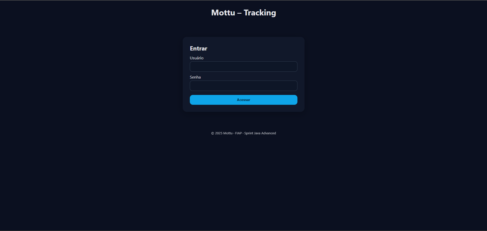
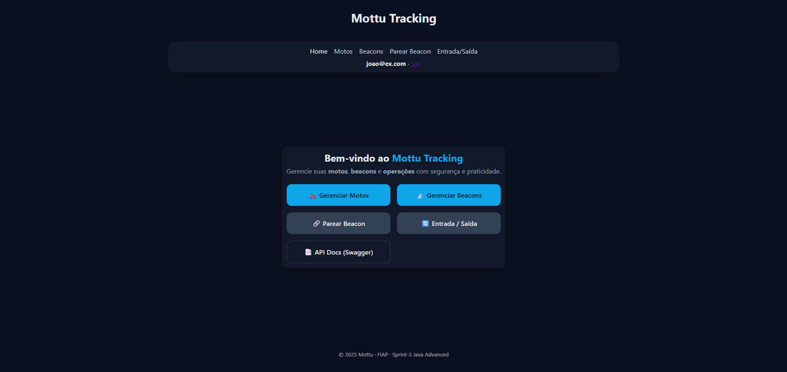
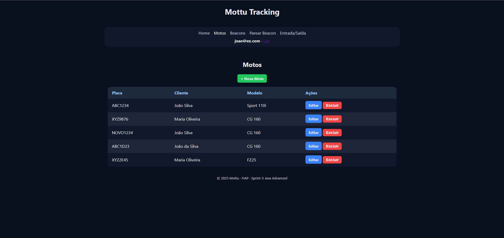
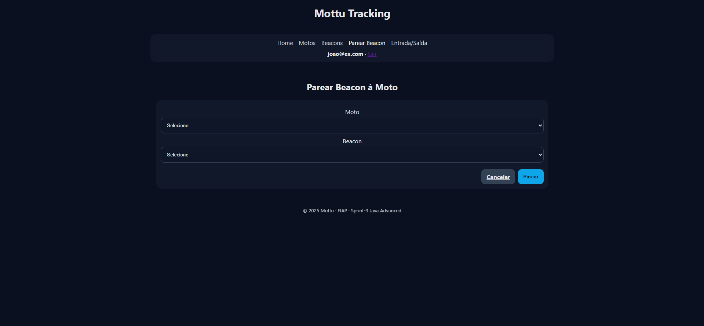
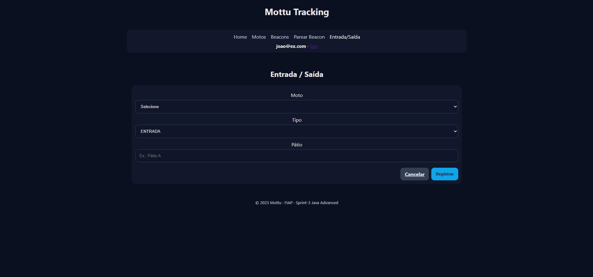

# 🏍️ Mottooth Tracking

Link: https://mottooth-java-1.onrender.com

Sistema inteligente para **rastreamento e gerenciamento de motocicletas** em pátios, utilizando **beacons Bluetooth Low Energy (BLE)**.  
Desenvolvido como parte da disciplina **Java Advanced – 3ª Sprint (FIAP)**.

---

## 📸 Demonstração do Sistema (UI com Thymeleaf)

### 🔹 Login


### 🔹 Página Inicial


### 🔹 Listagem de Motos


### 🔹 Listagem de Beacons


### 🔹 Pareamento de Moto ↔ Beacon


### 🔹 Registro de Entrada/Saída

---

## ⚙️ Tecnologias Utilizadas

- **Java 17**
- **Spring Boot 3.2.3**
- **Spring Data JPA**
- **Spring Web (REST + Thymeleaf)**
- **Thymeleaf** (frontend)
- **Spring Security** (login, logout e controle de acesso)
- **Spring Validation**
- **Flyway** (versionamento do banco)
- **Oracle Database** (produção)
- **Lombok**
- **Swagger / OpenAPI**

---

## 📂 Estrutura do Projeto

```bash
mottooth-java/
│── src/main/java/br/com/fiap/mottooth
│   ├── config/            # Configurações (cache, segurança, swagger, etc.)
│   ├── controller/        # Controladores REST + Thymeleaf (Auth, Moto, Beacon, Flow, etc.)
│   ├── dto/               # Objetos de transferência de dados (DTOs)
│   ├── exception/         # Tratamento centralizado de erros
│   ├── model/             # Entidades JPA (Moto, Beacon, Usuario, Movimentacao, etc.)
│   ├── repository/        # Repositórios Spring Data JPA
│   ├── service/           # Regras de negócio e serviços
│   └── MottoothApplication.java  # Classe principal
│
│── src/main/resources
│   ├── db/migration/      # Scripts Flyway de versionamento
│   ├── templates/         # Telas Thymeleaf (HTML)
│   │   ├── motos/         # CRUD de motos
│   │   ├── beacons/       # CRUD de beacons
│   │   ├── flows/         # Parear beacon e movimentações
│   │   └── fragments/     # Header, footer e menu
│   └── application.properties
│
├── docs/screens/          # 📸 Imagens de demonstração usadas no README
├── pom.xml
└── README.md
```

---

## 📜 Recursos Implementados

- **CRUD de Motos** → Gerenciamento completo da frota.
- **CRUD de Beacons** → Cadastro, edição e remoção de dispositivos BLE.
- **CRUD de Localizações** → Registro histórico da posição das motos.
- **Pareamento 1:1 Moto ↔ Beacon** → Associação exclusiva e validada.
- **Registro de Movimentações (Entrada/Saída)** → Histórico detalhado com validação de duplicatas.
- **Validação de Campos** → Bean Validation para consistência dos dados.
- **Paginação e Ordenação** → Consultas em lotes, ordenadas.
- **Busca por Parâmetros** → ID, placa, UUID e intervalos de tempo.
- **Cache de Requisições** → Otimização de consultas frequentes.
- **Tratamento Centralizado de Erros** → Respostas padronizadas de erro.
- **DTOs** → Separação de entidades do banco e transferência de dados.
- **Swagger / OpenAPI** → Documentação e testes via navegador.
- **Spring Security** → Autenticação, login/logout e controle por papéis.
- **Flyway** → Versionamento de tabelas e dados no banco Oracle.

---

## 🔗 Endpoints da API

### 🚗 Motos
- `GET /api/motos` → Lista todas as motos
- `GET /api/motos/{id}` → Busca moto pelo ID
- `GET /api/motos/placa/{placa}` → Busca moto pela placa
- `POST /api/motos` → Cadastra nova moto
- `PUT /api/motos/{id}` → Atualiza moto existente
- `DELETE /api/motos/{id}` → Remove moto

### 📡 Beacons
- `GET /api/beacons` → Lista todos os beacons
- `GET /api/beacons/{id}` → Busca beacon pelo ID
- `GET /api/beacons/uuid/{uuid}` → Busca beacon pelo UUID
- `POST /api/beacons` → Cadastra novo beacon
- `PUT /api/beacons/{id}` → Atualiza beacon existente
- `DELETE /api/beacons/{id}` → Remove beacon

### 📍 Localizações
- `GET /api/localizacoes` → Lista todas as localizações
- `GET /api/localizacoes/{id}` → Busca localização pelo ID
- `GET /api/localizacoes/moto/{motoId}/ultima` → Última localização de uma moto
- `POST /api/localizacoes` → Registra nova localização
- `PUT /api/localizacoes/{id}` → Atualiza localização existente
- `DELETE /api/localizacoes/{id}` → Remove localização

---

## ▶️ Como Executar o Projeto

1. Clone o repositório:
   ```bash
   git clone https://github.com/seu-usuario/mottooth-java.git
   cd mottooth-java
   ```

2. Configure o banco Oracle no `application.properties`:
   ```properties
   spring.datasource.url=jdbc:oracle:thin:@localhost:1521:xe
   spring.datasource.username=mottooth
   spring.datasource.password=senha
   spring.jpa.database-platform=org.hibernate.dialect.OracleDialect
   ```

3. Rode as migrações com Flyway automaticamente ao iniciar o projeto.

4. Compile e rode a aplicação:
   ```bash
   mvn spring-boot:run
   ```

5. Acesse no navegador:
    - **UI (Thymeleaf):** [http://localhost:8080](http://localhost:8080)
    - **Swagger API Docs:** [http://localhost:8080/swagger-ui.html](http://localhost:8080/swagger-ui.html)

---

## 🧪 Como Testar

- **Testar CRUD via UI (Thymeleaf)** → Cadastrar, editar e excluir motos/beacons.
- **Testar API (Swagger ou Postman)** → Executar chamadas REST listadas acima.
- **Autenticação (Spring Security)** → Login/logout, com papéis diferentes de usuário.
- **Validações** → Tentar inserir dados inválidos (placa duplicada, beacon repetido).
- **Movimentações** → Registrar entrada/saída e verificar histórico.
- **Flyway** → Conferir se as tabelas foram criadas e versionadas no Oracle.

---

## 👥 Equipe

- **Arthur Ramos dos Santos** – RM558798
- **Felipe Melo de Sousa** – RM556099
- **Robert Daniel da Silva Coimbra** – RM555881  
